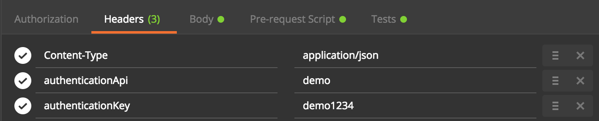
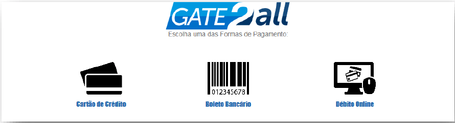
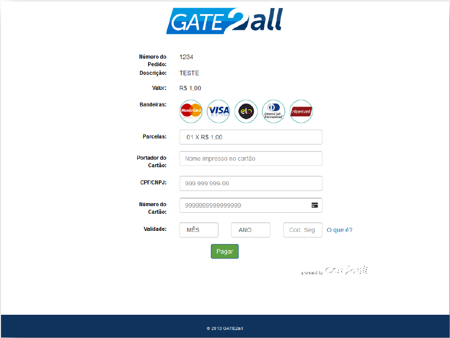
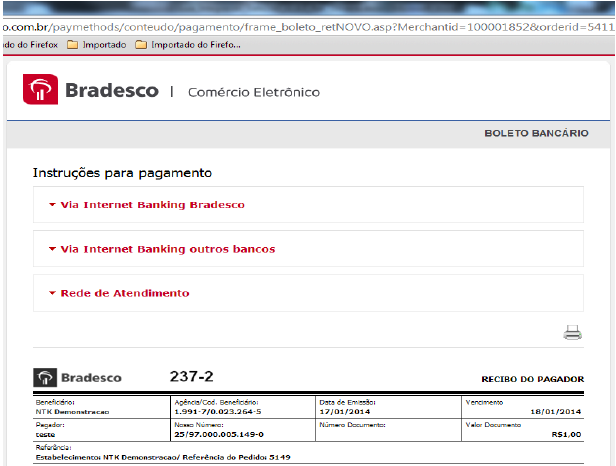
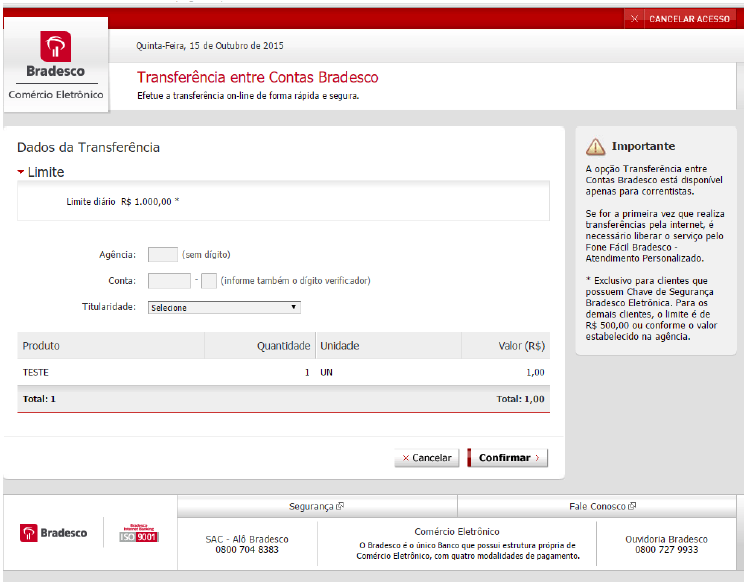
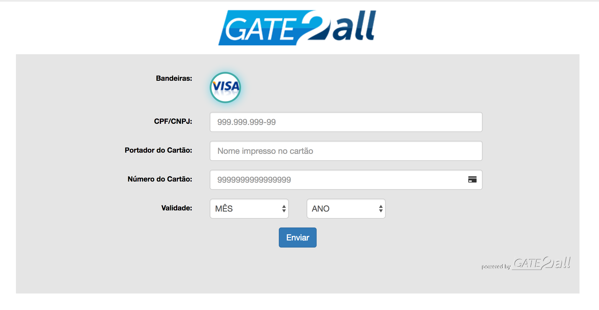
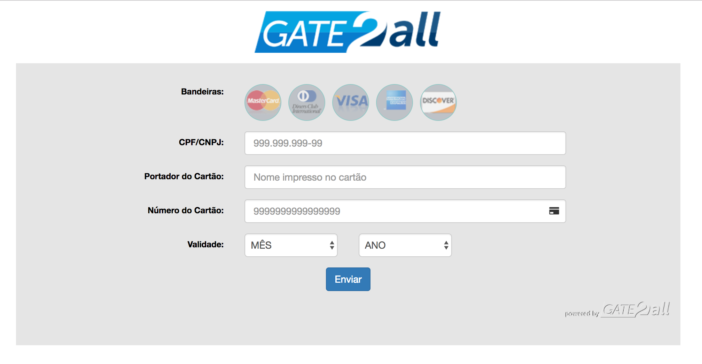

# Introdução

Olá! Bem vindo a API REST do **PayGo Gateway.**

Aqui você irá encontrar informações de como integrar seu sistema ao gateway de pagamentos **PayGo Gateway.**

O **PayGo Gateway** é uma plataforma de pagamentos que conecta lojas virtuais, app's mobile, ERP's ou sistema de cobranças com as principais instituições de pagamentos do Brasil.

Ao integrar-se ao gateway de pagamentos **PayGo Gateway** seu negócio poderá receber transações através das principais formas de pagamentos como cartão de crédito e débito, boleto bancário e transferência entre contas.

A vantagem de se utilizar nossa plataforma é que você não precisará se integrar a cada adquirente ou bancos, através do **PayGo Gateway** você se beneficia delas de forma unificada e sem complicações.

O **PayGo Gateway** segue as rigorosas normas do **PCI DSS** que são regras que visam proteger os dados do portador do cartão. Conheça mais no site [https://pt.pcisecuritystandards.org](https://pt.pcisecuritystandards.org)

## Sobre este documento

Este documento constitui a especificação técnica para integração de sistemas que desejam operar com o gateway de pagamento **PayGo Gateway**.

Aqui serão listadas todas as funcionalidades da plataforma **PayGo Gateway** especificando os endereços de requisição, parâmetros da requisição, formato e exemplos.

Disponibilizamos as coleções no client REST Postman. 

Para instalar o client Postman, basta acessar <a href='https://www.getpostman.com/' target='_blank'>https://www.getpostman.com</a> 

Para importar uma coleção contendo os endpoints e mensagens de exemplos, basta clicar no botão abaixo.

<a href="https://app.getpostman.com/run-collection/8ec1d4e437adde5f8e70" target="_blank"></a>


<aside class="warning">
As informações contidas neste documento estão sujeitas a alteração sem aviso prévio.
</aside>

### PÚBLICO

Este documento é destinado aos desenvolvedores e analistas de sistemas de e-commerce que desejem integrar sua loja virtual com o gateway **PayGo Gateway** para a realização de transações eletrônicas.

### CONTATOS

Suporte ao desenvolvedor é prestado através do e-mail <a href="mailto:dev@ntk.com.br">dev@ntk.com.br.</a>
<aside class="warning">
Nossa equipe de suporte a desenvolvedores não provê suporte para linguagens de programação e tecnologias utilizadas pelo desenvolvedor.
</aside>


## Glossário

**Autenticação**: Processo para assegurar que o comprador é o portador legítimo.

**Autorização**: Processo para verificar se uma compra pode ou não ser realizada num cartão. Verifica-se limite, se o cartão está ativo, se o portador está adimplente, etc.

**Cancelamento**: Processo para cancelar uma compra no cartão.

**Captura**: Processo para confirmar uma autorização. É após, a captura, que o portador recebe um débito na fatura de seu cartão.

**Chave de acesso**: Chave de autenticação da loja usada na chamada aos Web Services da Cielo.

**Comprador**: É aquele que efetua compra na loja virtual.

**Emissor**: Empresa responsável pela emissão do cartão utilizado pelo cliente para a realização de transações eletrônicas no Estabelecimento. Administradoras associadas a bancos são os principais emissores de cartões, assim como administradoras de cartões de benefício (refeição, alimentação, combustível, premiação, etc.).

**Estabelecimento comercial** ou **EC**: Empresa que responde pela loja virtual.

**Número de afiliação**: É um identificador que o lojista recebe após ter-se afiliado a Cielo.

**Portador**: É o mesmo que comprador. É aquele que tem o porte de um cartão.

**TID**: Identificador único da transação.

**Transação**: É o pedido de compra do portador na rede adquirente.

**Gateway de pagamento**: é uma aplicação que realiza transações financeiras através de web sites. Sua função basicamente é comunicar com as redes adquirentes e efetuar com segurança a captura dos dados do comprador.

**Rede Adquirente**: Empresa responsável por prover o serviço de captura de transações eletrônicas (seja de cartão de crédito/débito ou outro meio de pagamento). Cielo, Rede, GetNet e BANRISUL são exemplos de Redes adquirentes brasileiras.

**Bandeira**: Empresa definindo um padrão e provendo serviços de intercâmbio e troca de informações entre a Rede Adquirente e o Emissor. Visa, MasterCard e American Express são exemplos típicos de bandeiras.

**Tokenização**: Método para gravar cartão do comprador no ambiente Cielo para realização de transações sem o número do cartão.

**Soft Descriptor**: Função para incluir um texto que será exibido na fatura do cartão de crédito do comprador.

**Pré-autorização**: Tipo de transação que consulta e reserva um valor estimado para o estabelecimento como garantia até a conclusão da operação, aplica-se normalmente há locadoras de veículos e hotéis.

**Transferência online**: A Transferência entre contas bancárias é uma opção de pagamento on-line. Esse meio de pagamento utiliza-se do Internet Banking do lojista e do consumidor final. No momento do pagamento, basta informar os dados da conta, a senha e a frase secreta, e o banco efetuará a transferência do valor da compra diretamente para a loja, de forma rápida e segura.

## Pré-requisitos

Para que o lojista possa utilizar as funcionalidades do **PayGo Gateway**, este deve possuir afiliação para e-commerce junto às redes adquirentes ou bancos aos quais deseja encaminhar transações ou cobranças.

## Adquirentes integradas

**Cielo** API 1.5 e 3.0

**REDE** Komerci e e-Rede Adquirencia

**GetNet**

**Stone**

[Bandeiras suportadas](#bandeiras) 

<aside class="warning">
As transações de cartão de débito (Visa Electron e Mastercard Maestro) só são processadas se houver autenticação pelo mecanismo Verified by Visa ou Mastercard Secure Code.

Não são todos os bancos emissores da Mastercard Maestro que suportam transações autenticadas no e-commerce.

</aside>

## Bancos integrados

 Comércio Eletrônico Bradesco

* Emissão de boleto
* Transferência entre contas

 Bradesco

* Emissão de boleto registrado

 Itaú Shopline

* Emissão de boleto
* Transferência entre contas

## Tipos de Transações

### Crédito

As opções de pagamento com cartão de crédito são: 

* À vista. 
* Parcelado emissor. 
* Parcelado loja.

<aside class="warning">
O valor do resultante da divisão do valor do pedido pelo número de parcelas não deve ser inferior a R$5,00. Caso contrário a transação será negada.
</aside>
 
### Débito

Bandeiras Visa Electron e Maestro através da rede adquirente Cielo, para esta modalidade é necessário a autenticação do portador através dos mecanismos “Verify By Visa” ou “Mastercard Secure Code”.

O cartão do portador deve estar habilitado para transações autenticadas.

### Transferência on-line entre contas

Transferência online entre contas bancárias. Para utilizar este serviço o cliente deverá ter contratado junto ao banco o serviço de comercio eletrônico Bradesco ou Itaú Shopline.

### Boletos

Emissão de boleto bancário com os bancos, Bradesco e Itaú, com conciliação automática. A compensação do boleto poderá ser verificada através do relatório de transações.

Para utilizar este serviço o cliente deverá ter contratado junto ao banco o serviço de comercio eletrônico.

## Tipos de Integração

O gateway de pagamento **PayGo Gateway** permite dois tipos de integração:
 
1. **Loja**, que redireciona o comprador para um ambiente seguro do **PayGo Gateway** onde os dados do cartão serão capturados. 
2. **Integrado**, onde o lojista poderá capturar os dados do cartão em seu próprio sistema.


## Ambientes

Para utilizar nosso ambiente de testes envie um e-mail informando os dados abaixo para <a href="mailto:dev@ntk.com.br">dev@ntk.com.br</a> onde realizaremos o cadastro do desenvolvedor ou empresa responsável pelo desenvolvimento. 

* `RAZAO SOCIAL`
* `NOME FANTASIA`
* `CNPJ`
* `Nome do desenvolvedor`
* `Telefone`
* `E-mail`

### Ambiente Produção

**Requisição de transação**: https://api.gate2all.com.br/

### Ambiente de testes (Sandbox)

**Requisição de transação**: https://apidemo.gate2all.com.br/

**authenticationApi**: demo
**authenticationKey**: A420C95AF486F0E64437

## Cartões de Testes

Disponibilizamos os seguintes cartões de testes para simular os status das transações.

Status | Cartão |
-------|------- |
AUTORIZADA | Qualquer número de cartão que respeite <a href="https://en.wikipedia.org/wiki/Luhn_algorithm">Algoritmo Luhn</a>
FALHA NA COMUNICAÇÃO COM FORNECEDOR | 4676674786512068
PENDENTE DE CONFIRMAÇÃO TRANSAÇÃO_NAO_PROCESSADA NOFORNECEDOR | 4532365531093678
PENDENTE_DE_CONFIRMAÇÃO TRANSAÇÃO PROCESSADA NO FORNECEDOR | 5375387267180047
TRANSAÇÃO INICIADA | 4490861761911670 
CRIADA | 4490861761911670
NEGADA | 4035943194824415
TIMEOUT | 4539591924980550


## Números de Documentos de Testes Boleto e Transferência

Esses números de documento devem ser usados no nosso simulador Itaú.

Status | Número Documento |
-------|------- |
TRANSAÇÃO INICIADA | Qualquer número de documento válido
CONFIRMADA (BOLETO PAGO MAIOR +R$10,00) | 34331423786
CONFIRMADA (BOLETO PAGO MENOR -R$10,00) | 18805556890
CONFIRMADA (TRANSFERÊNCIA) | 45601654247
CONFIRMADA (BOLETO) | 74717683471


# Autenticação

Todas as requisições são autenticadas através das credenciais de acesso (USUÁRIO E CHAVE) fornecidos após o cadastro. Os dados de acesso são enviados pelo header.

* `Content-Type: application/json`
* `authenticationApi: USUÁRIO`
* `authenticationKey: CHAVE`

**Exemplo de configuração no POSTMAN:**



# PayGo Gateway Loja

No **PayGo Gateway** Loja é possível realizar vendas sem a necessidade de desenvolver-se uma página segura de pagamentos, por meio do recurso chamado **Intenção de Venda**. 

Através deste tipo de integração o comprador digita os dados do cartão no ambiente seguro do gateway de pagamentos **PayGo Gateway**, isentando a loja, da manipulação dos dados sensíveis do cartão do comprador.

## Intenção de Venda

Para realizar uma intenção de venda é necessário enviar um POST para o seguinte recurso: 

### Requisição

<aside class="request"><span class="method post">POST</span> <span class="endpoint">/v1/intention</span></aside>


```json
{
    "referenceId": "19893211234",
    "amount": "1000",
    "description": "Mouse sem fio",
    "postBackUrl": "http://url-notificacao",
    "redirectUrl": "http://url-redirect",
    "dtExpiration": "2018-03-25T18:10:53",
    "customer": {
        "name": "Comprador Teste",
        "document": "12345678909",
        "email": "compradorteste@gmail.com",
        "address": {
            "address": "Endereco",
            "number": "100",
            "complement": "Apartamento 22",
            "district": "Vila Olimpia",
            "zipcode": "09878675",
            "city": "Sao Paulo",
            "state": "SP"
        }
    },
    "payment": {
        "card": {
            "type": 0,
            "capture": false,
            "installments": "2",
            "fixedInstallments": false,
            "interestType": "3",
            "authenticate": "3",
            "softDescriptor": "PayGo Gateway",
            "saveCard": true,
            "recurrent": false
        },
        "electronicTransfer": {
            "provider": "Bradesco"
        },
        "bankSlip": {
            "expirationDate": "2018-03-30",
            "instructions": "Aceitar somente até a data de vencimento, após essa data juros de 1% dia",
            "guarantor": "Comprador Teste",
            "provider": "Bradesco"
        }
    }
}
```

```shell
```


```java

import java.io.BufferedReader;
import java.io.DataOutputStream;
import java.io.IOException;
import java.io.InputStreamReader;
import java.net.HttpURLConnection;
import java.net.URL;
import java.util.Scanner;

URL obj = new URL("https://api.2all.com.br/v1/intention");
HttpURLConnection con = (HttpURLConnection) obj.openConnection();

con.setRequestMethod("POST");
con.setRequestProperty("content-type", "application/json");
con.setRequestProperty("authenticationapi", "demo");
con.setRequestProperty("authenticationkey", "demo");

String body = "{"
        + "\"referenceId\": \"19893211234\","
        + "\"amount\": \"1000\","
        + "\"description\": \"Mouse sem fio\","
        + "\"postBackUrl\": \"http://url-notificacao\","
        + "\"redirectUrl\": \"http://url-redirect\","
        + "\"dtExpiration\": \"2018-01-25T18:10:53\","
        + "    \"customer\": {"
        + "       \"name\": \"Comprador Teste\","
        + "       \"document\": \"12345678909\","
        + "       \"email\": \"compradorteste@gmail.com\","
        + "       \"address\": {"
        + "           \"address\": \"Endereco\","
        + "           \"number\": \"100\","
        + "           \"district\": \"Vila Olimpia\","
        + "           \"complement\": \"Apartamento 22\","
        + "           \"zipcode\": \"09878675\","
        + "           \"city\": \"Sao Paulo\","
        + "           \"state\": \"SP\""
        + "        }"
        + "    },"
        + "   \"payment\": {"
        + "        \"card\": {"
        + "            \"type\": 0,"
        + "            \"capture\": false,"
        + "            \"installments\": \"2\","
        + "            \"fixedInstallments\": false,"
        + "            \"interestType\": \"4\","
        + "            \"authenticate\": \"3\","
        + "            \"softDescriptor\": \"PayGo Gateway\","
        + "            \"saveCard\": true,"
        + "            \"recurrent\": true"
        + "        },"
        + "        \"electronicTransfer\": {"
        + "            \"provider\": \"Bradesco\""
        + "        },"
        + "        \"bankSlip\": {"
        + "            \"expirationDate\": \"2018-03-30\","
        + "            \"instructions\": \"Aceitar somente ate a data de vencimento, apes essa data juros de 1% dia\","
        + "            \"guarantor\": \"Comprador Teste\","
        + "            \"provider\": \"Bradesco\""
        + "        }"
        + "    }"
        + "}";

con.setDoOutput(true);
DataOutputStream dos = new DataOutputStream(con.getOutputStream());
dos.writeBytes(body);
dos.flush();
dos.close();

Scanner scanner = new Scanner(new BufferedReader(new InputStreamReader(con.getInputStream())));
String response = scanner.nextLine();
scanner.close();

System.out.println(response);

```


|Propriedade|Tipo|Tamanho|Obrigatório|Descrição|
|-----------|----|-------|-----------|---------|
|`referenceId`|Texto|100|Sim|Número de identificação da loja.|
|`amount`|Número|16|Sim|Valor da transação sem pontuação. Os dois últimos dígitos são os centavos. (Ex: amount: 100 = R$ 1,00)|
|`description`|Texto|300|Não|Descrição da transação.|
|`postBackUrl`|Texto|—|Sim|URL onde o PayGo Gateway notificará eventuais status da trancação para o lojista [notificação](#notifica-o)|
|`redirectUrl`|Texto|—|Não|URL onde o PayGo Gateway redirecionará o comprador após o processamento da transação.|
|`dtExpiration`|Texto|20|Não|Data da expiração da intenção. Formato **2018-01-25T18:10:53** |
|`customer.name`|Texto|100|Sim|Nome do portador do cartão.|
|`customer.document`|Texto|18|Sim|Número do CPF/CNPJ do portador do cartão.|
|`customer.email`|Texto|100|Sim|Email do portador do cartão.|
|`address.address`|Texto|60|Sim|Endereço do comprador.|
|`address.number`|Texto|10|Sim|Número do endereço do comprador.|
|`address.complement`|Texto|150|Não|Complemento do endereço do comprador.|
|`address.district`|Texto|80|Sim|Bairro do comprador.|
|`address.zipcode`|Número|8|Sim|CEP do comprador.|
|`address.city`|Texto|30|Sim|Cidade do comprador.|
|`address.state`|Texto|2|Sim|Sigla do estado do comprador.|
|`card.type`|Número|1|Não|**Default: 0**, configura as opcões disponíveis. 1 Configura cartão de crédito. 2 Configura cartão de débito.|
|`card.capture`|Booleano|—|Sim|**true** = Autoriza e confirma a transação. **false** = Autorização, mas não confirma a transação, necessitando realizar a confirmação ([Captura](#captura)) noutra requisição.|
|`card.installments`|Número|2|Sim|Número de parcelas.|
|`card.fixedInstallments`|Booleano|—|Não|**Default: false** - **True** = não permite que o comprador selecione a quantidade de parcelas no formulário de pagamento.|
|`card.interestType`|Número|1|Não|**Default: 3** - Operações disponíveis: <BR /> 3. Parcelado Loja <BR /> 4. Parcelado Administrador|
|`card.authenticate`|Número|1|Não|**Default: 3** - Opções disponíveis: <BR /> 1. Autorizar só transações autenticadas <BR /> 2. Autorizar transações autenticadas ou não autenticadas <BR /> 3. Autorizar sem autenticação <BR /> |
|`card.softDescriptor`|Texto|22|Não|Texto a ser exibido na fatura do portador do cartão.[SoftDescriptor](#softdescriptor)|
|`card.saveCard`|Booleano|—|Não|Configura salvar o cartão (tokenização). |
|`card.recurrent`|Booleano|—|Não|Informa se a transação é recorrente. |
|`electronicTransfer.provider`|Texto|20|Sim|Nome da instituição responsável pela transferência.|
|`bankSlip.expirationDate`|Texto|20|Sim|Data de vencimento do boleto. formato **YYYY-MM-DD**|
|`bankSlip.instructions`|Texto|300|Sim|Instruções do boleto.|
|`bankSlip.guarantor`|Texto|45|Sim|Nome do avalista.|
|`bankSlip.provider`|Texto|20|Sim|Nome da instituição financeira :<ul><li>**BRADESCO**</li><li>**ITAU**</li></ul>|


### RESPOSTA SUCESSO

Status : 201

```json
{
  "transactionId": "b9bb32a8-401e-41a0-a9ee-af9e8ab0de92",
  "url": "https://api.2all.com.br.com.br/v1/payment/b9bb32a8-401e-41a0-a9ee-af9e8ab0de92"
}
```

|Propriedade|Tipo|Tamanho|Descrição|
|-----------|----|-------|---------|
|`transactionId`|Texto|36|Identificador da transação do PayGo Gateway.|
|`url`|Texto|150|URL da intenção.|

### RESPOSTA ERRO

Status : 400

```json
{
  "error": {
    "message": "amount nao pode ser vazio"
  }
}
```

|Propriedade|Tipo|Tamanho|Descrição|
|-----------|----|-------|---------|
|`error.message`|Texto|50|Texto informando o erro na geração da Intenção de Venda.|


<aside class="success">
Redirecione o comprador para a URL da resposta.
</aside>

## Acessando uma intenção de venda

Após o usuario acessar a URL gerada, aparecerá a seguinte tela de pagamento:



Caso a forma de pagamento escolhida pelo usuário for cartão de crédito, aparecerá a seguinte tela:



Após a conclusão do preenchimento do formulário o PayGo Gateway enviará uma [notificação](#notifica-o) via POST contendo o `transactionId` e o `referenceId` para o sistema do lojista realizar a [consulta](#consulta) da transação notificada.

Caso a forma de pagamento escolhida pelo usuário for boleto, aparecerá a seguinte tela:



Caso a forma de pagamento escolhida pelo usuário for transferência, aparecerá a seguinte tela:



Em caso de erro ou token incorreto aparecerá a seguinte tela:


## Customizar tema dos formulários

Utilizando nossos formulários que capturam os dados do cartão é possível customizar logo, cor de fundo, cor do formulário, cor das fontes, botão do envio e a cor do rodapé. 

Para customizar os formulários acesse o [painel de controle](https://gate.2all.com.br) e clique no menu [**"Configurações>Formulário de pagamento"**](https://gate.2all.com.br/ntk/configuracao-cliente).


# PayGo Gateway Integrado 

`(CHECKOUT TRANSPARENTE)`

Neste modelo todo o relacionamento com o usuário é realizado pela loja virtual, inclusive eventual
captura de dados de cartões de crédito. Portanto sua loja virtual deverá ser homologada PCI, para
maiores informações consulte o site https://www.pcisecuritystandards.org

A loja virtual deve fazer a captura de todos os dados necessários e submetê-los ao **PayGo Gateway**.

## Autorização

Para criar uma autorização é necessário enviar um POST para o seguinte recurso:

<aside class="notice">
Para se recuperar eventuais problemas com TIME OUT nas requisições, recomendamos a consulta pelo número do pedido `referenceId` ou criando uma <b>Intenção de Venda</b> e informando o mesmo `transactionId` na requisição com os dados do cartão. Desta maneira é possível realizar uma consulta para verificar o status da transação. 
</aside>
### REQUISIÇÃO

<aside class="request"><span class="method post">POST</span> <span class="endpoint">/v1/transactions</span></aside>

```json
{
   "referenceId": "19893211234",
   "amount": "1000",
   "description": "Mouse sem fio",
   "customer": {
      "name": "Comprador Teste",
      "document": "12345678909"
   },
   "payment": {
       "card": {
          "type": 1,
          "capture": false,
          "installments": 1,
          "interestType": 3,
          "authenticate": 3,
          "softDescriptor": "Pagamento PayGo Gateway",
          "saveCard": false,
          "recurrent": false,
          "provider": "Cielo",
          "providerVersion": "3.0",
          "cardInfo": {
              "number": "4539708473330561",
              "expirationMonth": "04",
              "expirationYear": "2019",
              "cvv": "234",
              "brand": "VISA",
              "holderName": "HOLDER NAME"
            }
        }
   }
}
```

```shell
```

```java

import java.io.*;
import java.net.HttpURLConnection;
import java.net.URL;
import java.util.Scanner;

URL obj = new URL("https://api.2all.com.br/v1/transactions");
HttpURLConnection con = (HttpURLConnection) obj.openConnection();

con.setRequestMethod("POST");
con.setRequestProperty("content-type", "application/json");
con.setRequestProperty("authenticationapi", "demo");
con.setRequestProperty("authenticationkey", "demo");

String body = "{"
        + "\"referenceId\": \"123456\","
        + "\"amount\": \"1000\","
        + "\"description\": \"Venda Teste\","
        + "\"postBackUrl\": \"http://url-notificacao\","
        + "\"customer\": {"
        + "    \"name\": \"COMPRADOR TESTE\","
        + "     \"document\": \"23650403811\""
        + "},"
        + " \"payment\": {"
        + "    \"card\": {"
        + "        \"type\": 1,"
        + "        \"capture\": false,"
        + "        \"installments\": 1,"
        + "        \"interestType\": 3,"
        + "        \"authenticate\": 3,"
        + "        \"saveCard\": false,"
        + "        \"recurrent\": false,"
        + "        \"softDescriptor\": \"Gate2All\","
        + "        \"cardInfo\": {"
        + "           \"number\": \"4539708473330561\","
        + "           \"expirationMonth\": \"04\","
        + "           \"expirationYear\": \"2019\","
        + "           \"cvv\": \"234\","
        + "           \"brand\": \"VISA\","
        + "           \"holderName\": \"COMPRADOR TESTE\""
        + "        }"
        + "      }"
        + "   }"
        + "}";

con.setDoOutput(true);
DataOutputStream dos = new DataOutputStream(con.getOutputStream());
dos.writeBytes(body);
dos.flush();
dos.close();

Scanner scanner = new Scanner(new BufferedReader(new InputStreamReader(con.getInputStream())));
String response = scanner.nextLine();
scanner.close();

System.out.println(response);

```

|Propriedade|Tipo|Tamanho|Obrigatório|Descrição|
|-----------|----|-------|-----------|---------|
|`transactionId`|Texto|150|Não|Identificador da transação do PayGo Gateway.|
|`referenceId`|Texto|100|Sim|Número de identificação da loja.|
|`amount`|Número|16|Sim|Valor da transação sem pontuação. Os dois últimos dígitos são os centavos. (Ex: amount: 100 = R$ 1,00)|
|`description`|Texto|300|Não|Descrição da transação.|
|`postBackUrl`|Texto|—|Não|URL onde o PayGo Gateway notificará eventuais status da trancação para o lojista [notificação](#notifica-o)|
|`customer.name`|Texto|100|Sim|Nome do portador do cartão.|
|`customer.document`|Texto|18|Não|Número do CPF/CNPJ do portador do cartão.|
|`card.type`|Número|1|Não|**Default: 1** - Configura as opcões disponíveis. 1 Configura cartão de crédito. 2|
|`card.softDescriptor`|Texto|22|Não|Texto a ser exibido na fatura do portador do cartão.[SoftDescriptor](#softdescriptor)|
|`card.capture`|Booleano|—|Sim|**true** = Autoriza e confirma a transação . **false** = Autorização, mas não confirma a transação, necessitando realizar a confirmação ([Captura] (#captura)) noutra requisição.|
|`card.installments`|Número|2|Sim|Número de parcelas.|
|`card.interestType`|Número|1|Não|**Default: 3** - Operações disponíveis: <BR /> 3. Parcelado Loja <BR /> 4. Parcelado Administrador|
|`card.authenticate`|Número|1|Não|**Default: 3** - Opções disponíveis: <BR /> 1. Autorizar só transações autenticadas <BR /> 2. Autorizar transações autenticadas ou não autenticadas <BR /> 3. Autorizar sem autenticação <BR /> |
|`card.provider`|Número|—|Não|Nome do Fornecedor (Adquirente) pela qual a autorização vai ser processada. [Redes Adquirentes](#redes-adquirentes)|
|`card.providerVersion`|Texto|11|Não|Versão da Integração do Fornecedor| 
|`card.saveCard`|Booleano|—|Não|**Default: false** - Configura salvar o cartão (tokenização). |
|`card.recurrent`|Booleano|—|Não|**Default: false** - Informa se a transação é recorrente. |
|`cardInfo.number`|Texto|19|Sim|Número do cartão.|
|`cardInfo.expirationMonth`|Número|2|Sim|Mês da validade do cartão. Formato **MM**|
|`cardInfo.expirationYear`|Número|4|Sim|Ano da validade do cartão. Formato **YYYY**|
|`cardInfo.cvv`|Número|4|Sim|Código de segurança do cartão.|
|`cardInfo.brand`|Texto|20|Sim|Bandeira do cartão.[Bandeiras](#bandeiras).|
|`cardInfo.holderName`|Texto|25|Não|Nome do Portador impresso no cartão, **só aceita caracteres**|

### RESPOSTA

> Transação autorizada e não capturada

```json
{
  "transactionId": "92d50ba4-5d93-4ee5-90e8-9884b250310a",
  "referenceId": "1463697571584",
  "description": "TV LG 42",
  "amount": "1000",
  "status": 5,
  "dtTransaction": "2018-03-05T12:04:20",
  "payment": {
    "card": {
      "type": 1,
      "softDescriptor": "Gate2All",
      "interestType": 3,
      "installments": 1,
      "capture": false,
      "authenticate": 3,
      "saveCard": false,
      "recurrent": false,
      "provider": "CIELO",
      "providerVersion": "3.0",
      "authenticationECI": 7,
      "codAuthorization": "123456",
      "providerReference": "1006993069000834928A",
      "providerCode": "00",
      "providerMessage": "Transacao autorizada com sucesso",
      "cardInfo": {
        "number": "453970******0561",
        "expirationMonth": "04",
        "expirationYear": "2019",
        "cvv": "***",
        "brand": "VISA",
        "holderName": "HOLDER NAME"
      }
    }
  },
  "customer": {
    "name": "HOLDER NAME",
    "document": "12345678909"
  }
}
```


```shell
```


> Falha

```json
{
  "error": {
    "message": "O campo amount e obrigatorio."
  }
}
```

```shell
```

|Propriedade|Tipo|Tamanho|Descrição|
|-----------|----|-------|-----------|---------|
|`transactionId`|Texto|150|Identificador da transação do PayGo Gateway.|
|`dtTransaction`|DataHora|19|Data e hora da transação.|
|`card.provider`|Texto|10|Nome da instituição financeira.|
|`card.providerVersion`|Texto|11|Versão da Integração do Fornecedor| 
|`card.providerMessage`|Texto|100|Mensagem da instituição.|
|`card.providerCode`|Texto|100|Codigo de resposta da instituição.|
|`card.codAuthorization`|Texto|100|Codigo de autorização da instituição.|
|`card.authenticationECI`|Texto|100|Indicador de autenticação da transação.[Códigos ECI](#status-eci)|
|`status`|Número|2|Status da transação retornado pelo PayGo Gateway [catálogo](#status).|

## Boleto

O boleto bancário ou bloqueto é um método de pagamento de produtos ou serviços. É amplamente utilizado por empresas no Brasil.

Entidades envolvidas: “Banco” que são as instituições financeiras responsáveis pela emissão, recebimento e pagamento do boleto, “Cedente” é quem solicita a emissão do documento de cobrança e o que receberá o valor do pagamento e o “Sacado” que é consumidor do produto ou serviço, ou seja, quem paga o boleto.

Como é o processo de pagamento com boleto bancário:

1. Cedente encaminha para o Sacado o Boleto
2. Sacado efetua o pagamento até a data de vencimento estipulada.
3. Banco recebe o valor e repassa para conta do Cedente.
4. Banco aplica a taxa acordada entre as partes.

### Requisição

<aside class="request"><span class="method post">POST</span> <span class="endpoint">/v1/transactions</span></aside>

```json
{
   "referenceId": "19893211234",
   "amount": "1000",
   "description": "Produto ou serviço",
   "customer": {
      "name": "Comprador",
      "document": "12345678909",
      "email" : "comprador@email.com",
      "address" : {
          "address" : "Endereco",
          "number" : "100",
          "complement": "Apartamento 22",
          "district" : "Vila Olimpia",
          "zipcode" : "09878675",
          "city" : "Sao Paulo",
          "state" : "SP"
      }
   },
   "payment": {
       "bankSlip" : {
            "expirationDate" :"2018-03-10",
            "instructions" : "Aceitar somente até a data de vencimento, após essa data juros de 1% dia",
            "guarantor" : "Comprador",
            "provider":"Itau"
       }
    }
}
```

```shell
```

```java

import java.io.BufferedReader;
import java.io.DataOutputStream;
import java.io.IOException;
import java.io.InputStreamReader;
import java.net.HttpURLConnection;
import java.net.URL;
import java.util.Scanner;

URL obj = new URL("https://api.2all.com.br/v1/transactions");
HttpURLConnection con = (HttpURLConnection) obj.openConnection();

con.setRequestMethod("POST");
con.setRequestProperty("content-type", "application/json");
con.setRequestProperty("authenticationapi", "demo");
con.setRequestProperty("authenticationkey", "demo");

String body = "{"
        + "\"referenceId\": \"123456789\","
        + "\"amount\": \"1000\","
        + "\"description\": \"TV LG 42\","
        + "\"postBackUrl\": \"http://url-notificacao\","
        + "\"customer\": {"
        + "    \"name\": \"COMPRADOR TEST\","
        + "    \"document\": \"12345678909\","
        + "    \"email\" : \"comprador@ntk.com\","
        + "    \"address\" : {"
        + "        \"address\" : \"Rua Fidencio Ramos\","
        + "        \"number\": \" 100\","
        + "        \"complement\": \"Apartamento 22\","
        + "        \"district\" : \"Vila Olimpia\","
        + "        \"zipcode\" : \"05890090\","
        + "        \"city\" : \"Sao Paulo\","
        + "        \"state\" : \"SP\""
        + "        }"
        + "    },"
        + "    \"payment\": {"
        + "        \"bankSlip\" : {"
        + "            \"expirationDate\" :\"2018-03-10\","
        + "            \"instructions\" : \"Aceitar somente ate a data de vencimento, apos essa data juros de 1% dia\","
        + "            \"guarantor\" : \"Joao da Silva\","
        + "            \"provider\":\"Itau\""
        + "        }"
        + "    }"
        + "}";

con.setDoOutput(true);
DataOutputStream dos = new DataOutputStream(con.getOutputStream());
dos.writeBytes(body);
dos.flush();
dos.close();

Scanner scanner = new Scanner(new BufferedReader(new InputStreamReader(con.getInputStream())));
String response = scanner.nextLine();
scanner.close();

System.out.println(response);


```


|Propriedade|Tipo|Tamanho|Obrigatório|Descrição|
|-----------|:----:|:-------:|:-----------:|---------|
|`transactionId`|Texto|150|Não|Utilize somente para intenções de venda previamente configuradas|
|`referenceId`|Texto|100|Sim|Número de identificação da loja.|
|`amount`|Número|16|Sim|Valor da transação sem pontuação. Os dois últimos dígitos são os centavos. (Ex: amount: 100 = R$ 1,00)|
|`description`|Texto|300|Não|Descrição da transação.|
|`customer.name`|Texto|100|Sim|Nome do portador do cartão.|
|`customer.document`|Texto|18|Sim|Número do CPF/CNPJ do portador do cartão.|
|`customer.email`|Texto|100|Sim|Email do portador do cartão.|
|`address.address`|Texto|60|Sim|Endereço do comprador.|
|`address.number`|Texto|10|Sim|Número do comprador.|
|`address.complement`|Texto|150|Não|Complemento do endereço do comprador.|
|`address.district`|Texto|80|Sim|Bairro do comprador.|
|`address.zipcode`|Número|8|Sim|CEP do comprador.|
|`address.city`|Texto|30|Sim|Cidade do comprador.|
|`address.state`|Texto|2|Sim|Sigla do estado do comprador.|
|`bankSlip.expirationDate`|Texto|20|Sim|Data de vencimento do boleto. formato **YYYY-MM-DD**|
|`bankSlip.instructions`|Texto|300|Sim|Instruções do boleto.|
|`bankSlip.guarantor`|Texto|45|Sim|Nome do avalista.|
|`bankSlip.provider`|Texto|20|Sim|Nome da instituição financeira :<ul><li>**BRADESCO**</li><li>**ITAU**</li></ul>|

### RESPOSTA

```json
{
  "transactionId": "7365ca65-70d4-4d7c-ac3d-a20f5730c241",
  "referenceId": "19893211234",
  "amount": "1000",
  "description": "Produto ou serviço",
  "dtTransaction": "2018-03-08T10:46:31-0300",
  "customer": {
    "name": "Comprador",
    "document": "12345678909",
    "email": "comprador@email.com",
    "address": {
      "address": "Endereco",
      "number": "100",
      "complement": "Apartamento 22",
      "district": "Vila Olimpia",
      "zipcode": "09878675",
      "city": "Sao Paulo",
      "state": "SP"
    }
  },
  "payment": {
    "bankSlip": {
      "providerReference": "20575112",
      "providerCode": "00",
      "providerMessage": "Transação iniciada",
      "emissionDate": "2018-03-08",
      "expirationDate": "2018-03-10",
      "instructions": "Aceitar somente até a data de vencimento, após essa data juros de 1% dia",
      "guarantor": "Comprador",
      "provider": "ITAU",
      "paymentDate": "2018-03-08",
      "paymentAmount": "100",
      "url": "https://api.2all.com.br.com.br/v1/url-payment/6400d988-cc4b-4084-80ee-d5575dbbed4d"
    }
  },
  "status": 0
}
```


```shell  
```


|Propriedade|Tipo|Tamanho|Descrição|
|-----------|:----:|:-------:|---------|
|`transactionId`|Texto|150|Identificador da transação do PayGo Gateway.|
|`dtTransaction`|DataHora|19|Data e hora da transação.|
|`bankSlip.emissionDate`|Texto|20|Data de emissão do boleto. formato **YYYY-MM-DD**|
|`bankSlip.paymentDate`|Texto|20|Data de pagamento do boleto. formato **YYYY-MM-DD**|
|`bankSlip.paymentAmount`|Número|16|Valor de pagamento do boleto sem pontuação. Os dois últimos dígitos são os centavos. (Ex: amount: 100 = R$ 1,00)|
|`bankSlip.url`|Texto|300|Endereço de acesso da transação.|
|`bankSlip.providerReference`|Texto|100|Referência da instituição.|
|`bankSlip.providerCode`|Texto|100|Codigo de resposta da instituição.|
|`bankSlip.providerMessage`|Texto|100|Mensagem da instituição.|
|`status`|Número|2|[tabela de Status](#status)|


## Transferência entre contas bancárias

Este tipo de transação permite a transferência de valores entre contas do bancos Bradesco e Itaú, a compensação é realizada no mesmo dia. Esse meio de pagamento direciona o comprador para o Internet Bank para realizar o processo de autenticação.

No momento do pagamento, o cliente comprador informa os dados da agência, informa os dados da conta, como senha de 4 dígitos e do dispositivo de segurança (Cartão Chave de Segurança, token ou - versão Eletrônica ou no Celular.

### Requisição

<aside class="request"><span class="method post">POST</span> <span class="endpoint">/v1/transactions</span></aside>

```json
{
    "referenceId": "19893211234",
    "amount": "1000",
    "description": "Produto ou serviço",
    "customer": {
      "name": "Comprador",
      "document": "12345678909",
      "email": "comprador@email.com",
      "address": {
        "address": "Endereco 100",
        "number" : "100",
        "complement": "Apartamento 22",
        "district": "Vila Olimpia",
        "zipcode": "05890090",
        "city": "Sao Paulo",
        "state": "SP"
      }
    },
   "payment": {
       "electronicTransfer" : {
           "provider" : "Itau"
       }
    }
}
```

```shell
```

```java

import java.io.BufferedReader;
import java.io.DataOutputStream;
import java.io.IOException;
import java.io.InputStreamReader;
import java.net.HttpURLConnection;
import java.net.URL;
import java.util.Scanner;

URL obj = new URL("https://api.2all.com.br/v1/transactions");
HttpURLConnection con = (HttpURLConnection) obj.openConnection();

con.setRequestMethod("POST");
con.setRequestProperty("content-type", "application/json");
con.setRequestProperty("authenticationapi", "demo");
con.setRequestProperty("authenticationkey", "demo");

String body = "{"
        + "\"referenceId\": \"123456789\","
        + "\"amount\": \"1000\","
        + "\"description\": \"TV LG 42\","
        + "    \"customer\": {"
        + "       \"name\": \"COMPRADOR TESTE\","
        + "       \"document\": \"12345678909\","
        + "       \"email\" : \"comprador@ntk.com\","
        + "           \"address\" : {"
        + "               \"address\" : \"Rua Fidencio Ramos 100\","
        + "               \"number\": \" 100\","
        + "               \"complement\": \"Apartamento 22\","
        + "               \"district\" : \"Vila Olimpia\","
        + "               \"zipcode\" : \"05890090\","
        + "               \"city\" : \"Sao Paulo\","
        + "               \"state\" : \"SP\""
        + "      }"
        + "   },"
        + "   \"payment\": {"
        + "       \"electronicTransfer\" : {"
        + "          \"provider\" : \"Itau\""
        + "       }"
        + "    }"
        + "}";

con.setDoOutput(true);
DataOutputStream dos = new DataOutputStream(con.getOutputStream());
dos.writeBytes(body);
dos.flush();
dos.close();

Scanner scanner = new Scanner(new BufferedReader(new InputStreamReader(con.getInputStream())));
String response = scanner.nextLine();
scanner.close();

System.out.println(response);


```

|Propriedade|Tipo|Tamanho|Obrigatório|Descrição|
|-----------|:----:|:-------:|:-----------:|---------|
|`transactionId`|Texto|150|Não|Utilize somente para intenções de venda previamente configuradas|
|`referenceId`|Texto|100|Sim|Número de identificação da loja.|
|`amount`|Número|16|Sim|Valor da transação sem pontuação. Os dois últimos dígitos são os centavos. (Ex: amount: 100 = R$ 1,00)|
|`description`|Texto|300|Não|Descrição da transação.|
|`customer.name`|Texto|100|Sim|Nome do portador do cartão.|
|`customer.document`|Texto|18|Sim|Número do CPF/CNPJ do portador do cartão.|
|`customer.email`|Texto|100|Sim|Email do portador do cartão.|
|`address.address`|Texto|60|Sim|Endereço do comprador.|
|`address.number`|Texto|10|Sim|Número do comprador.|
|`address.complement`|Texto|150|Não|Complemento do endereço do comprador.|
|`address.district`|Texto|80|Sim|Bairro do comprador.|
|`address.zipcode`|Número|8|Sim|CEP do comprador.|
|`address.city`|Texto|30|Sim|Cidade do comprador.|
|`address.state`|Texto|2|Sim|Sigla do estado do comprador.|
|`electronicTransfer.provider`|Texto|20|Sim|Nome da instituição financeira :<ul><li>**BRADESCO**</li><li>**ITAU**</li></ul>|

### RESPOSTA

```json
{
    "transactionId": "6400d988-cc4b-4084-80ee-d5575dbbed4d",
    "referenceId": "19893211234",
    "amount": "1000",
    "description": "Produto ou serviço",
    "dtTransaction": "2018-03-05T16:16:14-0200",
    "customer": {
      "name": "Comprador",
      "document": "12345678909",
      "email": "comprador@email.com",
      "address": {
        "address": "Endereco 100",
        "number" : "100",
        "complement": "Apartamento 22",
        "district": "Vila Olimpia",
        "zipcode": "05890090",
        "city": "Sao Paulo",
        "state": "SP"
      }
    },
    "payment": {
        "electronicTransfer": {
            "providerReference": "20518839",
            "provider": "Itau",
            "url": "https://api.2all.com.br.com.br/v1/url-payment/6400d988-cc4b-4084-80ee-d5575dbbed4d"
        }
    },
    "status": 0
}
```


```shell
```


|Propriedade|Tipo|Tamanho|Descrição|
|-----------|:----:|:-------:|---------|
|`transactionId`|Texto|150|Identificador da transação do PayGo Gateway.|
|`dtTransaction`|DataHora|19|Data e hora da transação.|
|`electronicTransfer.provider`|Texto|20|Nome da instituição financeira :<ul><li>**BRADESCO**</li><li>**ITAU**</li></ul>|
|`electronicTransfer.url`|Texto|300|Endereço de acesso da transação.|
|`electronicTransfer.providerReference`|Texto|100|Referência da instituição.|
|`status`|Número|2|[tabela de Status](#status)|


# Captura

Captura é a confirmação de uma transação autorizada, após a captura que é confirmada a transação entre lojista e comprador, gerando o crédito para o lojista e o lançamento do débito na fatura do portador do cartão.

### Regras da captura

|Rede adquirente|Prazo|Captura Parcial|
|---------------|-----|---------------|
|`Cielo`|5 dias|Sim|
|`Rede(Komerci)`|2 minutos|Não|
|`GetNet`|20 dias|Sim|

* O prazo pode ser alterado para até 28 dias.

* Transações de pré-autorização podem ser capturadas em até 30 dias.

### Requisição

<aside class="request"><span class="method put">PUT</span> <span class="endpoint">/v1/transactions/{{transactionId}}/capture</span></aside>

```java

import java.io.*;
import java.net.HttpURLConnection;
import java.net.URL;
import java.util.Scanner;

URL obj = new URL("https://api.2all.com.br/v1/transactions/{{transactionId}}/capture");
HttpURLConnection con = (HttpURLConnection) obj.openConnection();
con.setRequestMethod("PUT");
con.setRequestProperty("content-type", "application/json");
con.setRequestProperty("authenticationapi", "demo");
con.setRequestProperty("authenticationkey", "demo");

Scanner scanner = new Scanner(new BufferedReader(new InputStreamReader(con.getInputStream())));
String response = scanner.nextLine();
scanner.close();

System.out.println(response);

```

|Propriedade|Tipo|Tamanho|Obrigatório|Descrição|
|-----------|----|-------|-----------|---------|
|`transactionId`|Texto|150|Sim|Identificador da transação (autorização) do PayGo Gateway.|

### RESPOSTA

> Transação autorizada e capturada

```json
{
    "transactionId": "62f5a0b2-c632-4e4e-bc51-3b6681a54a3c",
    "referenceId": "1488917347840",
    "amount": "1000",
    "status": 6,
    "dtTransaction": "2018-03-07T17:09:07",
    "payment": {
        "card": {
          "type": 1,
          "installments": 1,
          "capture": false,
          "recurrent": false,
          "authenticate": 3,
          "interestType": 1,
          "saveCard": false,
          "provider": "CIELO",
          "providerVersion": "3.0",
          "authenticationECI": 7,
          "codAuthorization": "123456",
          "providerReference": "100699306900094D905A",
          "providerCode": "00",
          "providerMessage": "Transacao capturada com sucesso",
          "cardInfo": {
              "number": "421847******1234",
              "brand": "VISA",
              "holderName": "HOLDER NAME"
          }
        }
    },
    "customer": {
        "name": "HOLDER NAME",
        "document": "23650403811"
    }
}
```


```shell
```

## Captura Parcial

Para efetuar uma captura parcial, é necessário enviar um POST passando como parâmetro o valor a ser capturado.

### Requisição

<aside class="request"><span class="method put">PUT</span> <span class="endpoint">/v1/transactions/{{transactionId}}/capture?amount=100</span></aside>

```java

import java.io.*;
import java.net.HttpURLConnection;
import java.net.URL;
import java.util.Scanner;

URL obj = new URL("https://api.2all.com.br/v1/transactions/{{transactionId}}/capture?amount=200");
HttpURLConnection con = (HttpURLConnection) obj.openConnection();
con.setRequestMethod("PUT");
con.setRequestProperty("content-type", "application/json");
con.setRequestProperty("authenticationapi", "demo");
con.setRequestProperty("authenticationkey", "demo");

Scanner scanner = new Scanner(new BufferedReader(new InputStreamReader(con.getInputStream())));
String response = scanner.nextLine();
scanner.close();

System.out.println(response);

```

|Propriedade|Tipo|Tamanho|Obrigatório|Descrição|
|-----------|----|-------|-----------|---------|
|`transactionId`|Texto|150|Sim|Identificador da transação do PayGo Gateway.|
|`amount`|Número|16|Sim|Valor da transação a ser capturado sem pontuação. Os dois últimos dígitos são os centavos. (Ex: amount: 100 = R$ 1,00)|

### RESPOSTA

> Transação autorizada e capturada

```json
{
    "transactionId": "62f5a0b2-c632-4e4e-bc51-3b6681a54a3c",
    "referenceId": "1488917347840",
    "amount": "1000",
    "status": 6,
    "dtTransaction": "2018-03-07T17:09:07",
    "payment": {
        "card": {
          "type": 1,
          "installments": 1,
          "capture": false,
          "capturedAmount": "200",
          "recurrent": false,
          "authenticate": 3,
          "interestType": 3,
          "saveCard": false,
          "provider": "CIELO",
          "providerVersion": "3.0",
          "authenticationECI": 7,
          "codAuthorization": "123456",
          "providerReference": "100699306900094D905A",
          "providerCode": "00",
          "providerMessage": "Transacao capturada com sucesso",
          "cardInfo": {
              "number": "421847******1234",
              "brand": "VISA",
              "holderName": "HOLDER NAME"
          }
        }
    },
    "customer": {
        "name": "HOLDER NAME",
        "document": "23650403811"
    }
}
```


```shell
```

# Cancelamento

Para realizar um cancelamento "estorno", deve-se observar as seguintes condições:

### Prazos para cancelamento

|Rede adquirente|Prazo para cancelamento|
|---------------|-----|
|`Cielo`|300 dias|
|`Rede(Komerci)`|* Até às 23:59 a partir da data da transação. <BR /> * Pré-autorização prazo 15 dias.|
|`GetNet`|Até 2 dias.|

### Requisição

<aside class="request"><span class="method put">PUT</span> <span class="endpoint">/v1/transactions/{{transactionId}}/void</span></aside>

```java

import java.io.*;
import java.net.HttpURLConnection;
import java.net.URL;
import java.util.Scanner;

URL obj = new URL("https://api.2all.com.br/v1/transactions/957221f5-d08b-4445-9896-52152f31b846/void");
HttpURLConnection con = (HttpURLConnection) obj.openConnection();
con.setRequestMethod("PUT");
con.setRequestProperty("content-type", "application/json");
con.setRequestProperty("authenticationapi", "demo");
con.setRequestProperty("authenticationkey", "demo");

Scanner scanner = new Scanner(new BufferedReader(new InputStreamReader(con.getInputStream())));
String response = scanner.nextLine();
scanner.close();

System.out.println(response);

```

|Propriedade|Tipo|Tamanho|Obrigatório|Descrição|
|-----------|----|-------|-----------|---------|
|`transactionId`|Texto|150|Sim|Identificador da transação do PayGo Gateway.|

### RESPOSTA

> Transação cancelada

```json
{
    "transactionId": "62f5a0b2-c632-4e4e-bc51-3b6681a54a3c",
    "referenceId": "1488917347840",
    "amount": "200",
    "status": 9,
    "dtTransaction": "2018-03-07T17:09:07",
    "payment": {
        "card": {
            "type": 1,
            "interestType": 3,
            "installments": 1,
            "capture": false,
            "authenticate": 3,
            "provider": "CIELO",
            "providerVersion": "3.0",
            "authenticationECI": 7,
            "codAuthorization": "123456",
            "providerReference": "100699306900094D905A",
            "providerCode": "00",
            "providerMessage": "Transacao cancelada com sucesso",
            "saveCard": false,
            "cardInfo": {
                "number": "421847******1234",
                "brand": "VISA",
                "holderName": "HOLDER NAME"
            }
        }
    },
    "customer": {
        "name": "HOLDER NAME",
        "document": "23650403811"
    }
}
```


```shell
```

# Consulta

Para realizar uma consulta é necessário enviar um GET para o seguinte recurso:

### Requisição

<aside class="request"><span class="method get">GET</span> <span class="endpoint">/v1/transactions/{{transactionId}}</span></aside>

```java

import java.io.*;
import java.net.HttpURLConnection;
import java.net.URL;
import java.util.Scanner;

URL obj = new URL("https://api.2all.com.br/v1/transactions/d31dcd70-6666-40af-85ba-ed1ff23bc293");
HttpURLConnection con = (HttpURLConnection) obj.openConnection();
con.setRequestMethod("GET");
con.setRequestProperty("content-type", "application/json");
con.setRequestProperty("authenticationapi", "demo");
con.setRequestProperty("authenticationkey", "demo");

Scanner scanner = new Scanner(new BufferedReader(new InputStreamReader(con.getInputStream())));
String response = scanner.nextLine();
scanner.close();

System.out.println(response);

```

|Propriedade|Tipo|Tamanho|Obrigatório|Descrição|
|-----------|----|-------|-----------|---------|
|`transactionId`|Texto|150|Sim|Identificador da transação do PayGo Gateway.|


### RESPOSTA

> Retorno Transação de Crédito.

```json
{
  "transactionId": "62f5a0b2-c632-4e4e-bc51-3b6681a54a3c",
  "referenceId": "1488917347840",
  "amount": "100",
  "status": 9,
  "dtTransaction": "2018-03-07T17:09:07",
  "payment": {
    "card": {
      "type": 1,
      "interestType": 3,
      "integrationType": 1,
      "installments": 1,
      "capture": false,
      "authenticate": 3,
      "codAuthorization": "123456",
      "providerReference": "100699306900094D905A",
      "saveCard": false,
      "recurrent": false,
      "provider": "CIELO",
      "providerVersion": "3.0",
      "cardInfo": {
        "number": "421847******1234",
        "brand": "VISA",
        "holderName": "HOLDER NAME"
      }
    }
  },
  "customer": {
    "name": "HOLDER NAME",
    "document": "23650403811"
  }
}
```

> Retorno Transação com Boleto

```json
{
  "transactionId": "7365ca65-70d4-4d7c-ac3d-a20f5730c241",
  "referenceId": "19893211234",
  "amount": "1000",
  "description": "Produto ou serviço",
  "dtTransaction": "2018-03-08T10:46:31-0300",
  "customer": {
    "name": "Comprador",
    "document": "12345678909",
    "email": "comprador@email.com",
    "address": {
      "address": "Endereco",
      "number": "100",
      "complement": "Apartamento 22",
      "district": "Vila Olimpia",
      "zipcode": "09878675",
      "city": "Sao Paulo",
      "state": "SP"
    }
  },
  "payment": {
    "bankSlip": {
      "providerReference": "20575112",
      "emissionDate": "2018-03-08",
      "expirationDate": "2018-03-10",
      "instructions": "Aceitar somente até a data de vencimento, após essa data juros de 1% dia",
      "guarantor": "Comprador",
      "provider": "ITAU",
      "paymentDate": "2018-03-08",
      "paymentAmount": "100",
      "url": "https://api.2all.com.br.com.br/v1/url-payment/6400d988-cc4b-4084-80ee-d5575dbbed4d"
    }
  },
  "status": 0
}
```

> Retorno Transação com Transferência

```json
{
    "transactionId": "6400d988-cc4b-4084-80ee-d5575dbbed4d",
    "referenceId": "19893211234",
    "amount": "1000",
    "description": "Produto ou serviço",
    "dtTransaction": "2018-03-05T16:16:14-0200",
    "customer": {
      "name": "Comprador",
      "document": "12345678909",
      "email": "comprador@email.com",
      "address": {
        "address": "Endereco 100",
        "number" : "100",
        "complement": "Apartamento 22",
        "district": "Vila Olimpia",
        "zipcode": "05890090",
        "city": "Sao Paulo",
        "state": "SP"
      }
    },
    "payment": {
        "electronicTransfer": {
            "providerReference": "20518839",
            "provider": "Itau",
            "url": "https://api.2all.com.br.com.br/v1/url-payment/6400d988-cc4b-4084-80ee-d5575dbbed4d"
        }
    },
    "status": 0
}
```

```shell  
```

|Propriedade|Tipo|Tamanho|Obrigatório|Descrição|
|-----------|----|-------|-----------|---------|
|`referenceId`|Texto|100|Sim|Número de identificação da loja.|
|`amount`|Número|16|Sim|Valor da transação sem pontuação. Os dois últimos dígitos são os centavos. (Ex: amount: 100 = R$ 1,00)|
|`status`|Número|2|Não|Status da transação retornado pelo gateway. [catálogo](#status)| 
|`customer.name`|Texto|100|Sim|Nome do portador do cartão.|
|`customer.document`|Texto|18|Não|Número do CPF/CNPJ do portador do cartão.|
|`customer.mail`|Texto|40|Não|E-mail do portador do cartão.|
|`address.address`|Texto|60|Sim|Endereço do comprador.|
|`address.number`|Texto|10|Sim|Número do comprador.|
|`address.complement`|Texto|150|Não|Complemento do endereço do comprador.|
|`address.district`|Texto|80|Sim|Bairro do comprador.|
|`address.zipcode`|Número|8|Sim|CEP do comprador.|
|`address.city`|Texto|30|Sim|Cidade do comprador.|
|`address.state`|Texto|2|Sim|Sigla do estado do comprador.|
|`card.type`|Número|1|Não|Configura as opcões disponíveis. 1 Configura cartão de crédito. 2 Configura cartão de débito.|
|`card.installments`|Número|2|Sim|Número de parcelas.|
|`card.capture`|Booleano|—|Sim|**true** = Autoriza e confirma a transação . **false** = Autorização, mas não confirma a transação, necessitando realizar a confirmação ([Captura] (#captura)) noutra requisição.|
|`card.authenticate`|Número|1|Não|**Default: 3** - Opções disponíveis: <BR /> 1. Autorizar só transações autenticadas <BR /> 2. Autorizar transações autenticadas ou não autenticadas <BR /> 3. Autorizar sem autenticação <BR /> |
|`card.interestType`|Número|1|Não|**Default: 3** - Operações disponíveis: <BR /> 3. Parcelado Loja <BR /> 4. Parcelado Administrador|
|`card.integrationType`|Número|1|Sim|Tipo de integração disponível pelo Gate2All: <BR /> 1. Integrado<BR /> 2. Loja <BR /> 3. Direto|
|`card.saveCard`|Booleano|—|Sim|Configura salvar o cartão (tokenização). |
|`card.codAuthorization`|Texto|100|Codigo de autorização da instituição.|
|`card.providerReference`|Texto|100|Referência da instituição.|
|`cardInfo.number`|Texto|19|Sim|Número do cartão.|
|`cardInfo.brand`|Texto|20|Sim|Bandeira do cartão. [Bandeiras](#bandeiras).|
|`cardInfo.holderName`|Texto|25|Não|Nome do Portador impresso no cartão, **só aceita caracteres**|
|`bankSlip.emissionDate`|Texto|20|Sim|Data de emissão do boleto. formato **YYYY-MM-DD**|
|`bankSlip.expirationDate`|Texto|20|Sim|Data de vencimento do boleto. formato **YYYY-MM-DD**|
|`bankSlip.instructions`|Texto|300|Sim|Instruções do boleto.|
|`bankSlip.guarantor`|Texto|45|Sim|Nome do avalista.|
|`bankSlip.provider`|Texto|20|Sim|Nome da instituição financeira :<ul><li>**BRADESCO**</li><li>**ITAU**</li></ul>|
|`bankSlip.paymentDate`|Texto|20|Data de pagamento do boleto. formato **YYYY-MM-DD**|
|`bankSlip.paymentAmount`|Número|16|Valor de pagamento do boleto sem pontuação. Os dois últimos dígitos são os centavos. (Ex: amount: 100 = R$ 1,00)|
|`bankSlip.url`|Texto|300|Endereço de acesso da transação.|
|`bankSlip.providerReference`|Texto|100|Referência da instituição.|
|`electronicTransfer.provider`|Texto|20|Nome da instituição financeira :<ul><li>**BRADESCO**</li><li>**ITAU**</li></ul>|
|`electronicTransfer.url`|Texto|300|Endereço de acesso da transação.|
|`electronicTransfer.providerReference`|Texto|100|Referência da instituição.|

## Consulta pelo número do Pedido

É possível realizar uma consulta pelo número do pedido através do seguinte recurso:

### Requisição

<aside class="request"><span class="method get">GET</span> <span class="endpoint">/v1/transactions?referenceId={{referenceId}}</span></aside>

```java

import java.io.*;
import java.net.HttpURLConnection;
import java.net.URL;
import java.util.Scanner;

URL obj = new URL("https://api.2all.com.br/v1/transactions?referenceId=1493321061725");
HttpURLConnection con = (HttpURLConnection) obj.openConnection();
con.setRequestMethod("GET");
con.setRequestProperty("content-type", "application/json");
con.setRequestProperty("authenticationapi", "demo");
con.setRequestProperty("authenticationkey", "demo");

Scanner scanner = new Scanner(new BufferedReader(new InputStreamReader(con.getInputStream())));
String response = scanner.nextLine();
scanner.close();

System.out.println(response);

```

|Propriedade|Tipo|Tamanho|Obrigatório|Descrição|
|-----------|----|-------|-----------|---------|
|`referenceId`|Texto|100|Sim|Número de identificação da loja.|


### RESPOSTA

> Retorno da Transação.

```json
[
  {
    "transactionId": "b9a37a7b-5ffe-4993-82ab-a26b6f332afe",
    "amount": "100",
    "status": 6,
    "dtTransaction": "2018-02-15T11:17:40"
  }
]
```


```shell  
```

|Propriedade|Tipo|Tamanho|Obrigatório|Descrição|
|-----------|----|-------|-----------|---------|
|`transactionId`|Texto|150|Sim|Identificador da transação retornado pelo gateway.|
|`amount`|Número|16|Sim|Valor da transação sem pontuação. Os dois últimos dígitos são os centavos. (Ex: amount: 100 = R$ 1,00)|
|`status`|Número|2|Não|Status da transação retornado pelo gateway. [catálogo](#status)|
|`dtTransaction`|DataHora|19|Data e hora da transação.|


## Consulta pelo número do Pedido com Limite

Também é possível realizar uma consulta pelo número do pedido passando um limite.

### Requisição

<aside class="request"><span class="method get">GET</span> <span class="endpoint">/v1/transactions?referenceId={{referenceId}}&limit=2</span></aside>

```java

import java.io.*;
import java.net.HttpURLConnection;
import java.net.URL;
import java.util.Scanner;

URL obj = new URL("https://api.2all.com.br/v1/transactions?referenceId=1493321061725&limit=2");
HttpURLConnection con = (HttpURLConnection) obj.openConnection();
con.setRequestMethod("GET");
con.setRequestProperty("content-type", "application/json");
con.setRequestProperty("authenticationapi", "demo");
con.setRequestProperty("authenticationkey", "demo");

Scanner scanner = new Scanner(new BufferedReader(new InputStreamReader(con.getInputStream())));
String response = scanner.nextLine();
scanner.close();

System.out.println(response);

```

|Propriedade|Tipo|Tamanho|Obrigatório|Descrição|
|-----------|----|-------|-----------|---------|
|`referenceId`|Texto|100|Sim|Número de identificação da loja.|
|`limit`|Número|10|Não|Limite Máximo de pedidos 10.|


### RESPOSTA

> Retorno da Transação.

```json
[
  {
    "transactionId": "894aa0ad-517a-435c-b95d-8f60f1a2b9f5",
    "amount": "100",
    "status": 5,
    "dtTransaction": "2018-02-16T07:37:23"
  },
  {
    "transactionId": "5dbc102d-2b4b-4755-9f14-1b4c3d8a6716",
    "amount": "100",
    "status": 5,
    "dtTransaction": "2018-02-16T07:37:00"
  }
]
```


```shell  
```

|Propriedade|Tipo|Tamanho|Obrigatório|Descrição|
|-----------|----|-------|-----------|---------|
|`transactionId`|Texto|150|Sim|Identificador da transação retornado pelo gateway.|
|`amount`|Número|16|Sim|Valor da transação sem pontuação. Os dois últimos dígitos são os centavos. (Ex: amount: 100 = R$ 1,00)|
|`status`|Número|2|Não|Status da transação retornado pelo gateway. [catálogo](#status)|
|`dtTransaction`|DataHora|19|Data e hora da transação.|

# Tokenização

O método de tokenização permite a realização de transações sem o envio dos dados do cartão de crédito pela loja virtual. Os dados do cartão são armazenados na rede adquirente que retorna um código associado ao número do cartão e o estabelecimento que solicitou o armazenamento.

Os dados do cartão poderão ser salvos de três formas:

1. Configurando o parâmetro ` "saveCard": true ` nas requisições de transação de cartão de crédito.

2. Acionando o formulário do PayGo Gateway para capturar os dados do cartão (desta forma seu sistema não manipula os dados sensíveis do cartão).

3. Enviando os dados do cartão via POST.

**REGRAS DA TOKENIZAÇÃO:**

* **Disponível somente para adquirente Cielo.**
* Cada código de token é único por estabelecimento comercial. Se o mesmo cartão for “tokenizado” para outro estabelecimento, este terá um token diferente.
* Caso um estabelecimento envie duas ou mais vezes para gravar os mesmos dados de cartão, será retornado sempre o mesmo token.
* Não há garantia que o cartão gravado terá todas as suas transações autorizadas, pois são processos independentes e distintos.
* Um token não utilizado poderá ser removido do banco de dados da adquirente, conforme politica própria.

<aside class="warning">A adquirente poderá cobrar valores pelo serviço de armazenamento de dados de cartões de crédito.</aside>

Esta integração permite que o desenvolvedor da loja virtual implemente:

* Transação em um click ou “one step checkout”.
* Recorrência de transações sem o armazenamento dos dados dos cartões.

## Tokenização com Formulário

Para criar um formulário que capturá os dados do cartão para gerar um token é necessário enviar um POST para o seguinte recurso:

### REQUISIÇÃO

<aside class="request"><span class="method post">POST</span> <span class="endpoint">/v1/tokenization/intention</span></aside>

```json
{
    "referenceId": "19893211234",
    "postBackUrl": "http://url-notificacao",
    "redirectUrl": "http://url-redirect",
    "cardInfo": {
      "brand" : "VISA"  
    }
}
```

```shell
```

```java

import java.io.BufferedReader;
import java.io.DataOutputStream;
import java.io.IOException;
import java.io.InputStreamReader;
import java.net.HttpURLConnection;
import java.net.URL;
import java.util.Scanner;

URL obj = new URL("https://api.2all.com.br/v1/tokenization/intention");
HttpURLConnection con = (HttpURLConnection) obj.openConnection();

con.setRequestMethod("POST");
con.setRequestProperty("content-type", "application/json");
con.setRequestProperty("authenticationapi", "demo");
con.setRequestProperty("authenticationkey", "demo");

String body = "{"
        + "\"postBackUrl\": \"http://url-notificacao\","
        + "\"redirectUrl\": \"http://url-redirect\","
        + "\"cardInfo\": {"
        + "\"brand\" : \"VISA\""
        + "}",
        + "}";

con.setDoOutput(true);
DataOutputStream dos = new DataOutputStream(con.getOutputStream());
dos.writeBytes(body);
dos.flush();
dos.close();

Scanner scanner = new Scanner(new BufferedReader(new InputStreamReader(con.getInputStream())));
String response = scanner.nextLine();
scanner.close();

System.out.println(response);

```

|Propriedade|Tipo|Tamanho|Obrigatório|Descrição|
|-----------|----|-------|-----------|---------|
|`referenceId`|Texto|100|Sim|Número de identificação da loja.|
|`postBackUrl`|Texto|—|Sim|URL onde o PayGo Gateway notificará eventuais status da tokenização para o lojista.|
|`redirectUrl`|Texto|—|Sim|URL onde o PayGo Gateway redirecionará o comprador após o processamento da tokenização.|
|`brand`|Texto|20|Não|Bandeira do cartão.[Bandeiras](#bandeiras).|


### RESPOSTA


```json
{
  "tokenizationId": "b303e861-37d3-4d11-866b-735c6ff58989",
  "referenceId": "1495660823910",
  "postBackUrl": "http://url-notificacao",
  "redirectUrl": "http://url-redirect",
  "url": "http://api.2all.com.br/v1/save-card/b303e861-37d3-4d11-866b-735c6ff58989",
  "saveCard": true,
  "cardInfo": {
    "brand": "VISA"
  }
}
```


```shell
```

|Propriedade|Tipo|Tamanho|Descrição|
|-----------|----|-------|-----------|---------|
|`tokenizationId`|Texto|36|Identificador da tokenização do PayGo Gateway.|
|`url`|Texto|150|URL disponível para acesso a tokenização.|
|`cardInfo.saveCard`|Booleano|—|Sim|Configura salvar o cartão (tokenização). |

<aside class="success">
Redirecione o comprador para a URL da resposta.
</aside>

<BR>

<aside class="notice">
Caso a bandeira seja passado como paramêtro, será disponibilizado a seguinte tela de acesso.
</aside>

<BR>



<BR>
<aside class="notice">
Caso não seja seja passado nenhuma bandeira como paramêtro, será disponibilizado a seguinte tela de acesso com as bandeiras configuradas.
</aside>

<BR>


## Tokenização Direta

Para realizar uma tokenização direta é necessário enviar um POST para o seguinte recurso:

### Requisição

<aside class="request"><span class="method post">POST</span> <span class="endpoint">/v1/tokenization</span></aside>


```json
{
    "referenceId": "19893211234",
    "postBackUrl": "http://url-notificacao",
    "cardInfo": {
      "number": "4024007148992927",
      "expirationMonth": "04",
      "expirationYear": "2019",
      "brand": "VISA",
      "holderName": "Comprador"
    }
}
```

```shell
```

```java

import java.io.BufferedReader;
import java.io.DataOutputStream;
import java.io.IOException;
import java.io.InputStreamReader;
import java.net.HttpURLConnection;
import java.net.URL;
import java.util.Scanner;

URL obj = new URL("https://api.2all.com.br/v1/tokenization");
HttpURLConnection con = (HttpURLConnection) obj.openConnection();

con.setRequestMethod("POST");
con.setRequestProperty("content-type", "application/json");
con.setRequestProperty("authenticationapi", "demo");
con.setRequestProperty("authenticationkey", "demo");

String body = "{"
    + "\"referenceId\": \"123456789\","
    + "\"postBackUrl\": \"http://url-notificacao\","
    + "    \"cardInfo\": {"
    + "        \"number\": \"4556326359707410\","
    + "        \"expirationMonth\": \"04\","
    + "        \"expirationYear\": \"2019\","
    + "        \"brand\": \"VISA\","
    + "        \"holderName\": \"Comprador\""
    + "      }"
    + "}";

con.setDoOutput(true);
DataOutputStream dos = new DataOutputStream(con.getOutputStream());
dos.writeBytes(body);
dos.flush();
dos.close();

Scanner scanner = new Scanner(new BufferedReader(new InputStreamReader(con.getInputStream())));
String response = scanner.nextLine();
scanner.close();

System.out.println(response);

```

|Propriedade|Tipo|Tamanho|Descrição|
|-----------|:----:|:-------:|---------|
|`referenceId`|Texto|100|Sim|Número de identificação da loja.|
|`postBackUrl`|Texto|—|URL onde o PayGo Gateway notificará os dados da tokenização.|
|`cardInfo.number`|Texto|20|Número do cartão truncado.|
|`cardInfo.expirationMonth`|Número|2|Mês da validade do cartão. Formato **MM**|
|`cardInfo.expirationYear`|Número|4|Ano da validade do cartão. Formato **YYYY**|
|`cardInfo.brand`|Texto|20|Bandeira do cartão.[Bandeiras](#bandeiras).|
|`cardInfo.holderName`|Texto|25|Nome do Portador impresso no cartão, **só aceita caracteres**|
### RESPOSTA

> Tokenização gerada

```json
{
  "tokenizationId": "f414a0b8-f5de-4245-aae5-733f10c1963d",
  "referenceId": "19893211234",
  "postBackUrl": "http://url-notificacao",
  "provider": "CIELO",
  "saveCard": true,
  "cardInfo": {
    "number": "402400******2927",
    "expirationMonth": "04",
    "expirationYear": "2018",
    "brand": "VISA",
    "token": "be4cbeb1-abb2-4913-8165-f86962143fa021",
    "holderName": "Comprador"
  }
}
```


```shell
```


|Propriedade|Tipo|Tamanho|Descrição|
|-----------|:----:|:-------:|---------|
|`tokenizationId`|Texto|36|Identificador da tokenização do PayGo Gateway.|
|`provider`|Texto|100|Nome da Rede Adquirente.|
|`saveCard`|Booleano|Sim|Configura salvar o cartão (tokenização).|
|`cardInfo.token`|Texto|100|Token do cartão.|

> Consulta Token

Para realizar uma consulta de token é necessário enviar um GET para o seguinte recurso:

### Requisição

<aside class="request"><span class="method get">GET</span> <span class="endpoint">/v1/tokenization/{{token}}</span></aside>

```java

import java.io.*;
import java.net.HttpURLConnection;
import java.net.URL;
import java.util.Scanner;

URL obj = new URL("https://api.2all.com.br/v1/tokenization/be4cbeb1-abb2-4913-8165-f86962143fa021");
HttpURLConnection con = (HttpURLConnection) obj.openConnection();
con.setRequestMethod("GET");
con.setRequestProperty("content-type", "application/json");
con.setRequestProperty("authenticationapi", "demo");
con.setRequestProperty("authenticationkey", "demo");

Scanner scanner = new Scanner(new BufferedReader(new InputStreamReader(con.getInputStream())));
String response = scanner.nextLine();
scanner.close();

System.out.println(response);

```

|Propriedade|Tipo|Tamanho|Obrigatório|Descrição|
|-----------|----|-------|-----------|---------|
|`token`|Texto|150|Sim|Token NTK retornado na tokenização do cartão.|


### RESPOSTA

> Retorno Consulta Token .

```json
{
  "tokenizationId": "7c6785d9-4922-4b0d-986e-9bb5e624c613",
  "referenceId": "1496173577825",
  "postBackUrl": "",
  "saveCard": true,
  "provider": "CIELO",
  "cardInfo": {
    "number": "402400******2927",
    "expirationMonth": "04",
    "expirationYear": "2018",
    "brand": "VISA",
    "token": "be4cbeb1-abb2-4913-8165-f86962143fa021",
    "holderName": "Comprador"
  }
}
```

|Propriedade|Tipo|Tamanho|Descrição|
|-----------|:----:|:-------:|---------|
|`tokenizationId`|Texto|36|Identificador da tokenização do PayGo Gateway.|
|`referenceId`|Texto|100|Número de identificação da loja.|
|`postBackUrl`|Texto|—|URL onde o PayGo Gateway notificará eventuais status da trancação para o lojista.|
|`provider`|Texto|100|Nome da Rede Adquirente.|
|`saveCard`|Booleano|Default true|
|`cardInfo.number`|Texto|20|Número do cartão truncado.|
|`cardInfo.expirationMonth`|Número|2|Mês da validade do cartão. Formato **MM**|
|`cardInfo.expirationYear`|Número|4|Ano da validade do cartão. Formato **YYYY**|
|`cardInfo.brand`|Texto|20|Bandeira do cartão.[Bandeiras](#bandeiras).|
|`cardInfo.token`|Texto|100|Token do cartão.|
|`cardInfo.holderName`|Texto|25|Nome do Portador impresso no cartão, **só aceita caracteres**|

## Consulta do token pelo Número de Referencia com Limite

Também é possível realizar uma consulta pelo número de referência passando ou não um limite.

### Requisição

<aside class="request"><span class="method get">GET</span> <span class="endpoint">/v1/tokenization?referenceId={{referenceId}}&limit=2</span></aside>

```java

import java.io.*;
import java.net.HttpURLConnection;
import java.net.URL;
import java.util.Scanner;

URL obj = new URL("https://api.2all.com.br/v1/tokenization?referenceId=1496173577825&limit=2");
HttpURLConnection con = (HttpURLConnection) obj.openConnection();
con.setRequestMethod("GET");
con.setRequestProperty("content-type", "application/json");
con.setRequestProperty("authenticationapi", "demo");
con.setRequestProperty("authenticationkey", "demo");

Scanner scanner = new Scanner(new BufferedReader(new InputStreamReader(con.getInputStream())));
String response = scanner.nextLine();
scanner.close();

System.out.println(response);

```

|Propriedade|Tipo|Tamanho|Obrigatório|Descrição|
|-----------|----|-------|-----------|---------|
|`referenceId`|Texto|100|Sim|Número de identificação da loja.|
|`limit`|Número|10|Não|Limite Máximo de referências 10.|


### RESPOSTA

> Retorno da Transação.

```json
[
  {
    "tokenizationId": "7c6785d9-4922-4b0d-986e-9bb5e624c613",
    "referenceId": "1496173577825",
    "postBackUrl": "",
    "saveCard": true,
    "provider": "CIELO",
    "cardInfo": {
      "number": "402400******2927",
      "expirationMonth": "04",
      "expirationYear": "2018",
      "brand": "VISA",
      "token": "be4cbeb1-abb2-4913-8165-f86962143fa021"
    }
  }
]
```


```shell  
```

|Propriedade|Tipo|Tamanho|Descrição|
|-----------|:----:|:-------:|---------|
|`tokenizationId`|Texto|36|Identificador da tokenização do PayGo Gateway.|
|`referenceId`|Texto|100|Número de identificação da loja.|
|`provider`|Texto|100|Nome da Rede Adquirente.|
|`saveCard`|Booleano|Default true|
|`cardInfo.number`|Texto|20|Número do cartão truncado.|
|`cardInfo.expirationMonth`|Número|2|Mês da validade do cartão. Formato **MM**|
|`cardInfo.expirationYear`|Número|4|Ano da validade do cartão. Formato **YYYY**|
|`cardInfo.brand`|Texto|20|Bandeira do cartão. [Bandeiras](#bandeiras).|
|`cardInfo.token`|Texto|100|Token do cartão.|


## Transação com Token

Para criar uma transação com token é necessário enviar um POST para o seguinte recurso:

### REQUISIÇÃO

<aside class="request"><span class="method post">POST</span> <span class="endpoint">/v1/transactions</span></aside>


```json
{
   "referenceId": "19893211234",
   "amount": "1000",
   "description": "Mouse sem fio",
   "customer": {
      "name": "Comprador Teste",
      "document": "12345678909"
   },
   "payment": {
       "card": {
          "type": 1,
          "capture": false,
          "installments": 1,
          "interestType": 3,
          "authenticate": 3,
          "softDescriptor": "Pagamento PayGo Gateway",
          "cardInfo": {
              "token": "4b6a2aa5-de91-4d52-a4d1-f265f208e5a321"
          }
       }
   }
}
```

```shell
```

```java

import java.io.BufferedReader;
import java.io.DataOutputStream;
import java.io.IOException;
import java.io.InputStreamReader;
import java.net.HttpURLConnection;
import java.net.URL;
import java.util.Scanner;

URL obj = new URL("https://api.2all.com.br/v1/transactions");
HttpURLConnection con = (HttpURLConnection) obj.openConnection();

con.setRequestMethod("POST");
con.setRequestProperty("content-type", "application/json");
con.setRequestProperty("authenticationapi", "demo");
con.setRequestProperty("authenticationkey", "demo");

String body = "{"
      + "\"referenceId\": \"123456789\","
      + "\"amount\": \"1000\","
      + "\"description\": \"TV LG 42\","
      + "\"postBackUrl\": \"http://requestb.in/qkg1clqk\","
      + "    \"customer\": {"
      + "        \"name\": \"LUIS A R ROMERO\","
      + "        \"document\": \"12345678909\""
      + "   },"
      + "    \"payment\": {"
      + "        \"card\": {"
      + "           \"type\": 1,"
      + "           \"capture\": true,"
      + "           \"installments\": 1,"
      + "           \"interestType\": 3,"
      + "           \"softDescriptor\": \"EC02\","
      + "           \"cardInfo\": {"
      + "               \"token\": \"7a7820d0-ff6d-484a-8b8e-988d6d0ec0cc21\""
      + "           }"
      + "        }"
      + "    }"
      + "   "
      + "}";

con.setDoOutput(true);
DataOutputStream dos = new DataOutputStream(con.getOutputStream());
dos.writeBytes(body);
dos.flush();
dos.close();

Scanner scanner = new Scanner(new BufferedReader(new InputStreamReader(con.getInputStream())));
String response = scanner.nextLine();
scanner.close();

System.out.println(response);

```

|Propriedade|Tipo|Tamanho|Obrigatório|Descrição|
|-----------|----|-------|-----------|---------|
|`referenceId`|Texto|100|Sim|Número de identificação da loja.|
|`amount`|Número|16|Sim|Valor da transação sem pontuação. Os dois últimos dígitos são os centavos. (Ex: amount: 100 = R$ 1,00)|
|`description`|Texto|300|Não|Descrição da transação.|
|`customer.name`|Texto|100|Sim|Nome do portador do cartão.|
|`customer.document`|Texto|18|Não|Número do CPF/CNPJ do portador do cartão.|
|`card.type`|Número|1|Não|**Default 1** - Configura as opcões disponíveis. 1 Configura cartão de crédito. 2 Configura cartão de débito.|
|`card.capture`|Boolano|—|Sim|**true** = Autoriza e confirma a transação . **false** = Autorização, mas não confirma a transação, necessitando realizar a confirmação ([Captura] (#captura)) noutra requisição.|
|`card.installments`|Número|2|Sim|Número de parcelas.|
|`card.interestType`|Número|1|Não|**Default: 3** - Operações disponíveis: <BR /> 3. Parcelado Loja <BR /> 4. Parcelado Administrador|
|`card.authenticate`|Número|1|Não|**Default: 3** - Opções disponíveis: <BR /> 1. Autorizar só transações autenticadas <BR /> 2. Autorizar transações autenticadas ou não autenticadas <BR /> 3. Autorizar sem autenticação <BR /> |
|`card.softDescriptor`|Texto|22|Não|Texto a ser exibido na fatura do portador do cartão.[SoftDescriptor](#softdescriptor)|
|`cardInfo.token`|Texto|100|Sim|Token gerado anteriormente pela operação de Tokenização.|

### RESPOSTA

> Transação autorizada e não capturada

```json
{
  "transactionId": "5a51ae6b-e91e-4b38-b596-e2acb77dca43",
  "referenceId": "1489093308860",
  "description": "Mouse sem fio",
  "amount": "1000",
  "status": 5,
  "dtTransaction": "2018-03-09T18:01:17",
  "payment": {
    "card": {
      "type": 1,
      "installments": 1,
      "capture": false,
      "authenticate": 3,
      "softDescriptor": "Pagamento PayGo Gateway",
      "interestType": 3,
      "integrationType": 1,
      "provider": "CIELO",
      "providerVersion": "3.0",
      "authenticationECI": 7,
      "codAuthorization": "123456",
      "providerReference": "10069930690009510E9A",
      "providerCode": "00",
      "providerMessage": "Transação autorizada",
      "saveCard": true,
      "cardInfo": {
        "number": "402400******2927",
        "expirationMonth": "04",
        "expirationYear": "2018",
        "cvv": "***",
        "brand": "VISA",
        "token": "4b6a2aa5-de91-4d52-a4d1-f265f208e5a321"
      }
    }
  },
  "customer": {
    "name": "Comprador Teste",
    "document": "12345678909"
  }
}
```


```shell
```

|Propriedade|Tipo|Tamanho|Descrição|
|-----------|----|-------|-----------|---------|
|`transactionId`|Texto|150|Identificador da transação do PayGo Gateway.|
|`dtTransaction`|DataHora|19|Data e hora da transação.|
|`card.provider`|Texto|100|Nome da instituição financeira.|
|`card.providerVersion`|Texto|11|Versão da Integração do Fornecedor| 
|`card.providerReference`|Texto|100|Referência da instituição.|
|`card.providerMessage`|Texto|100|Mensagem da instituição.|
|`card.providerCode`|Texto|100|Codigo de resposta da instituição.|
|`card.codAuthorization`|Texto|100|Codigo de autorização da instituição.|
|`card.authenticationECI`|Texto|100|Indicador de autenticação da transação.[Códigos ECI](#status-eci)|
|`cardInfo.number`|Texto|20|Número do cartão truncado.|
|`cardInfo.brand`|Texto|20|Bandeira do cartão.[Bandeiras](#bandeiras).|
|`cardInfo.expirationMonth`|Número|2|Mês da validade do cartão. Formato **MM**|
|`cardInfo.expirationYear`|Número|4|Ano da validade do cartão. Formato **YYYY**|
|`cardInfo.cvv`|Número|4|Código de segurança do cartão truncado|
|`status`|Número|2|Status da transação retornado pelo PayGo Gateway [catálogo](#status).|


# Notificação


No PayGo Gateway Loja e PayGo Gateway Integrado é possível enviar uma URL de Notificação na requisição ou registrar essa URL no PayGo Gateway caso seja a mesma URL para todas as requisições, o PayGo Gateway notificará qualquer mudança de status de uma transação na URL enviada ou registrada.
 
A notificação é um POST na URL com o seguinte corpo da mensagem em formato JSON:

> Exemplo de notificação

```json
{
	"transactionId": "91d4f152-7024-4a4a-a212-ab457fe6e766",
	"referenceId": "5SVM9W4"
}
```

```shell
curl -X POST \
  https://hookbin.com/bin/ZB77eo1a \
  -H 'cache-control: no-cache' \
  -H 'content-type: application/json' \
  -d '{
	"transactionId": "91d4f152-7024-4a4a-a212-ab457fe6e766",
	"referenceId": "5SVM9W4"
}'
```

A notificação espera como resposta um 200 (Status HTTP), caso a resposta não seja um 200, o sistema tentará 3 vezes mais. 
Lembrando que é possível efetuar a consulta em qualquer operação, com a consulta pelo transactionId ou pelo referenceId [consulta](#consulta) 